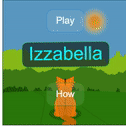

# Izzabella

  

  

Izzabella is a first person style chasing game where the title character must navigate through an arena and chase down prey. The game is made using [processing.js](http://processingjs.org/).

The main character will be a tiger that roams in a jungle looking for various animals/food that it finds along the way. Both the tiger and the NPC’s performs various activities depending on the situation. The tiger can move, run, pounce, crouch, stalk, strafe, and jump while the prey can flock, avoid and scurry when required. There are also obstacles and external forces (wind/rain) that can also affect gameplay. There are different animals and obstacles as the game progresses. Game loop architecture is used to model various static and dynamic characters in the game and also control game performance. The Title character to be controlled using the keyboard and/or mouse. All characters will have various states and activities depending on their proximity. Obstacles and characters can rotate and get affected by each other. The NPC and user’s character make decisions depending on their proximity. Particle systems were used to create certain obstacles and perhaps incorporated in the game background as well.
